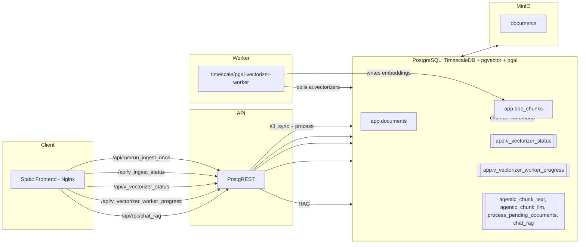

# Episode 2: From In-DB Embeddings to an Agentic, Vectorizer-Powered RAG

A build log and narrative on evolving a Postgres-only RAG into a cleaner, faster, more observable system by introducing pgai’s Vectorizer worker and agentic chunking.

## Why change a working baseline?

Our Episode 1 baseline proved a point: you can ship a minimal, fully working RAG chatbot using only PostgreSQL plus PostgREST and a static frontend. It chunked text and computed embeddings inside the database using `pgai`, then performed similarity search via `pgvector`, and finally called `ai.openai_chat_complete` to answer questions.

That baseline was simple—but it carried friction:

- Embeddings were computed synchronously in the database.
- The background job could not fill embeddings unless a per-request OpenAI key was supplied.
- Chunking lacked provenance (no precise character offsets or section-paths), which limits future features like citations and UI highlighting.
- Tying embedding to ingestion increased DB load and slowed end-to-end processing.

Episode 2 set out to address these pain points without breaking the API or the user experience.

## The goal

- Move embeddings out of the ingestion path and into a dedicated, asynchronous Vectorizer worker.
- Make chunking smarter (agentic) while preserving speed and determinism.
- Add provenance to chunks (`char_start`, `char_end`, `section_path`) so future features (citations, highlighting) are straightforward.
- Keep the same frontend and PostgREST RPCs so the user experience stays familiar.

## What we changed

- Introduced `timescale/pgai-vectorizer-worker` as a new service in `docker-compose.yml`. It watches the database and writes embeddings into `app.doc_chunks.embedding` asynchronously.
- Implemented agentic chunking in SQL:
  - Heuristic agentic chunker (`app.agentic_chunk_text`) that respects headings and paragraph boundaries.
  - Optional LLM-assisted planner (`app.llm_propose_boundaries` + `app.agentic_chunk_llm`) with safe fallbacks.
- Added provenance to chunks: `char_start`, `char_end`, `section_path`.
- Centralized OpenAI key management with a tiny secrets table (`app.app_secrets`) and helper RPCs. A small script syncs the key into `.env` for containers when needed.
- Left the RAG API alone (`app.chat_rag`) but updated it to read from the new `chunk_text` column.

## Architecture (Episode 2)

- Documents land in MinIO.
- A job (or a UI click) triggers `app.s3_sync_documents()` and then `app.process_pending_documents()`.
- The new chunkers write chunks into `app.doc_chunks` (with no embeddings). The Vectorizer worker fills embeddings later.
- `app.search_chunks()` and `app.chat_rag()` continue to work unchanged from the outside.

See `episode-2/architecture.mmd` for the Mermaid diagram and ideas below for rendering options.

Embedded Mermaid diagram (renders in GitHub/VS Code and many docs tools):



Static image (if generated): 

## Key decisions and trade-offs

- Keep Postgres-centric state but push heavy, externalized LLM work to a dedicated worker. This makes the DB a source of truth while improving throughput and resilience.
- Prefer a heuristic agentic chunker by default: it’s fast, deterministic, and aligns to document structure. LLM-assisted chunking is available as a mode for cases where semantic boundaries matter more.
- Add provenance now to unlock future features like citations, highlighting, and precise audit trails.
- Maintain API stability so UI and integrators don’t notice a breaking change—it should just get more reliable.

## What this enables next

- Hybrid search (FTS + vector), re-ranking, multi-query expansion, and citations can all be layered on without more ingestion changes. We’ve put the right primitives in place.
- Better observability: we can now track vectorizer status and worker progress in the UI, and reason about the system state without chasing logs.

## Implementation journey (highlights)

- `docker-compose.yml` grows a `vectorizer-worker` service with a custom entrypoint `scripts/vectorizer-start.sh` that fetches the OpenAI key from the DB if the environment is empty.
- `db/init/02_schema.sql` carries provenance columns and views that expose vectorizer status.
- `db/init/03_ingest.sql` introduces agentic chunkers and reworks `app.process_pending_documents()` to stop embedding in-DB. We also add quality-of-life RPCs like `run_ingest_once()` and `reset_chunks()`.
- `db/init/04_rag.sql` continues to expose `app.search_chunks()` and `app.chat_rag()`—now explicitly reading from `chunk_text`.
- `db/init/08_vectorizer.sql` defines the vectorizer over `app.doc_chunks` with `chunking_none()` (because we do chunking upstream) and `destination_column('embedding')`.
- Migrations lock in the upgrade path on existing databases:
  - `2025-09-16_part1_agentic_chunking.sql` (secrets, provenance, vectorizer create)
  - `2025-09-17_chunk_column_rename.sql` (`chunk` -> `chunk_text` + dependent fixes)
  - `2025-09-21_llm_agentic_chunking.sql` (LLM planning and mode-aware processing)
  - `2025-09-22_chunking_mode_stable.sql` (makes `chunking_mode()` STABLE so PostgREST can expose it cleanly)
- Frontend (`frontend/main.js`) learns to show vectorizer status and chunking mode while keeping the same UX for ingest and chat.

## Rollout and ops

- One-time install of pgai objects via the worker container.
- Store your OpenAI key in the DB via the UI/RPC—no more threading the key through every embedding request.
- Ingest is now: sync + chunk, then async embeddings appear as the worker processes the backlog.
- The UI shows end-to-end progress so you don’t guess whether embeddings are flowing.

## Results

- Ingestion latency for large corpora improves because embeddings are offloaded to a background worker.
- Chunk quality improves with fewer idea-breaking splits and more natural boundaries.
- The system is better instrumented: you can tell what’s pending, what’s done, and whether the worker is healthy.

## How to try it quickly

1) Start the stack:
```bash
make up
```

2) Install pgai objects (one-time):
```bash
docker compose run --rm vectorizer-worker \
  --entrypoint "python -m pgai install -d postgres://postgres:postgres@db:5432/pgai"
```

3) Set your OpenAI key in the DB (and optionally sync it into `.env`):
```bash
make set-key KEY=sk-...
make sync-key
```

4) Upload docs to MinIO and trigger ingest:
```bash
make ingest
```

5) Watch status:
```bash
make status
```

6) Ask a question in the UI (http://localhost:8080) or via PostgREST RPCs.

## What I’d measure next

- Retrieval quality deltas between `simple_chunk_text`, `agentic_chunk_text`, and `agentic_chunk_llm`.
- Embedding throughput and error rates from `app.v_vectorizer_worker_progress`.
- Query latencies and how `IVFFLAT` tuning (lists) changes performance as data grows.

## Closing thoughts

Episode 2 keeps the spirit of the baseline (Postgres-first) while making it more maintainable and production-friendly. By separating concerns—chunking in SQL, embeddings via a worker, chat via `pgai`—we get a cleaner architecture that scales with less ceremony and better observability.
